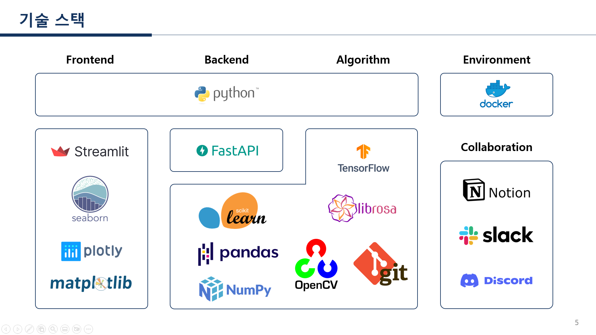
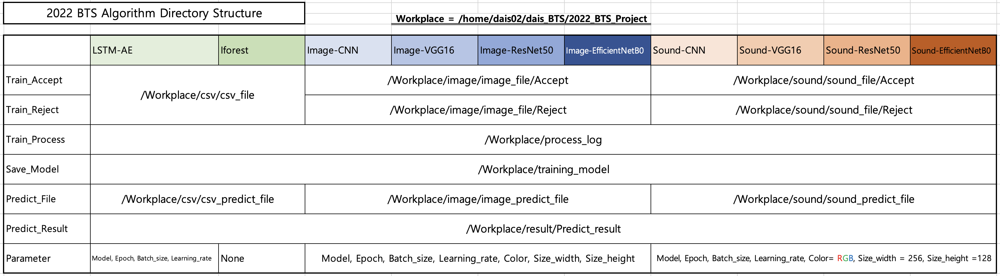

# 2022 BTS Project
> 이 프로젝트는 UNIST BTS 실전문제연구팀 사업에서 진행한 프로젝트입니다.
---

## Environment
- Docker(tensorflow 2.10.0-gpu)
- GPU(RTX 3080)
---

## Tech Stack

---

## Versions
- Python 3.5+
- Tensorflow 2.10.0
- Pandas 1.5.0
- Numpy 1.23.2
- Scikit learn
- Librosa
- Matplotlib 3.6.0
---

## Model
### Image
- CNN
- VGG16
- ResNet 50
- EfficientNet B0
### Time Series
- LSTM Autoencoder
- IForest
---

## Directory

---

## Update
- 추후 업데이트 예정.
---